<h1>Hi, I'm Nichita</h1>

  
  
  
  
  
    
  
  

 

I'm an Agentic AI Engineer. I build AI agents and automations that do real work in production: multi-agent workflows, MVPs that go from an idea to a deployed service, and MCP servers that give agents the tools they need. I love finding out how things work in depth, taking them apart, and building things that save people hours of repetitive work.

So far I've built 30+ automations in n8n and 8 MVPs that went from a first idea to a live service. Lately I've become especially interested in web data extraction, which is how [sluicer](https://github.com/Gi0tto/sluicer) was born: it turns a web page into structured data without a model in the loop. You'll find it here, along with whatever I build next.

When I'm not building, I'm into sports, football above all.
